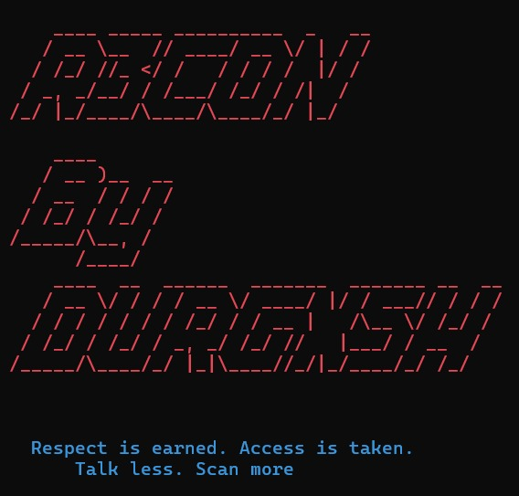

# R3CON - Advanced Reconnaissance Framework

<p align="center">
  
</p>

<p align="center">
  <strong>Automated reconnaissance and vulnerability scanning tool for bug bounty hunters and penetration testers</strong>
</p>

<p align="center">
  <a href="#installation">Installation</a> •
  <a href="#features">Features</a> •
  <a href="#usage">Usage</a> •
  <a href="#sample-output">Sample Output</a> •
  <a href="#tools-included">Tools Included</a> •
  <a href="#troubleshooting">Troubleshooting</a>
</p>

<p align="center">
  <i>"Respect is earned. Access is taken. Talk less. Scan more"</i>
</p>

## Installation

### One-Line Installation
```bash
curl -s https://raw.githubusercontent.com/Durgxsh/R3CON/main/install.sh | sudo bash
```

### Manual Installation
Follow these steps to install R3CON and its dependencies:

1. Install required packages:
```bash
sudo apt update
sudo apt install -y curl wget git ruby python3 python3-pip chromium-browser golang-go
```

2. Set up Go environment:
```bash
echo 'export GOPATH=$HOME/go' >> ~/.bashrc
echo 'export PATH=$PATH:$GOPATH/bin' >> ~/.bashrc
source ~/.bashrc
```

3. Install required tools:
```bash
# Install subfinder
GO111MODULE=on go install -v github.com/projectdiscovery/subfinder/v2/cmd/subfinder@latest

# Install httpx
GO111MODULE=on go install -v github.com/projectdiscovery/httpx/cmd/httpx@latest

# Install waybackurls
go install github.com/tomnomnom/waybackurls@latest

# Install getJS
go install github.com/003random/getJS@latest

# Install nuclei
GO111MODULE=on go install -v github.com/projectdiscovery/nuclei/v2/cmd/nuclei@latest

# Install gowitness
go install github.com/sensepost/gowitness@latest
```

4. Download and install R3CON:
```bash
curl -o /usr/local/bin/r3con https://raw.githubusercontent.com/Durgxsh/R3CON/main/R3CON.sh
chmod +x /usr/local/bin/r3con
```

## Features

- 🔍 **Subdomain Enumeration**: Discover all subdomains for a target
- 🌐 **Live Host Detection**: Find which hosts are actually live
- 📚 **Historical URL Discovery**: Extract URLs from Wayback Machine
- 🔗 **Parameter URL Identification**: Find potential injection points
- 📜 **JavaScript Analysis**: Extract both archived and live JS files
- 🔒 **Vulnerability Scanning**: Automatically detect security issues
- 📸 **Website Screenshots**: Take screenshots of all live hosts
- 📊 **Vulnerability Summary**: Clean output of found security issues

## Usage

### Basic Scan
```bash
r3con example.com
```

### Scan with Parameter Testing
```bash
r3con example.com params
```

All results are organized in a folder named `Recon-domain-date` in your current directory.

## Sample Output


    ____ _____ __________  _   __
   / __ \__  // ____/ __ \/ | / /
  / /_/ //_ </ /   / / / /  |/ /
 / _, _/__/ / /___/ /_/ / /|  /
/_/ |_/____/\____/\____/_/ |_/

    ____
   / __ )__  __
  / __  / / / /
 / /_/ / /_/ /
/_____/\__, /
      /____/
    ____  __  ______  _______  _______ __  __
   / __ \/ / / / __ \/ ____/ |/ / ___// / / /
  / / / / / / / /_/ / / __ |   /\__ \/ /_/ /
 / /_/ / /_/ / _, _/ /_/ //   |___/ / __  /
/_____/\____/_/ |_|\____//_/|_/____/_/ /_/


  Respect is earned. Access is taken.
      Talk less. Scan more

[1] Running subfinder...
    Subdomains found: 7
    ✔ Subdomains stored at: Recon-httpbin.org-27-07-2025/subdomains.txt
[2] Probing live subdomains with httpx...
    Live hosts found: 2
    ✔ Live hosts stored at: Recon-httpbin.org-27-07-2025/live.txt
[3] Fetching archive URLs with waybackurls...
    Wayback URLs found: 37943
    ✔ Wayback URLs stored at: Recon-httpbin.org-27-07-2025/wayback-main.txt
[4] Extracting URLs with parameters from wayback...
    Parameter URLs found: 35947
    ✔ Parameter URLs stored at: Recon-httpbin.org-27-07-2025/params.txt
[5] Extracting archived JS URLs from wayback...
    
[...]

Vulnerability Summary:
•  vulnerabilities found in live hosts
      2 [httpbin-xss] [http] [high]
      2 [httpbin-open-redirect] [http] [medium]
      2 [httpbin-contenttype-xss] [http] [medium]
```

## Tools Included

- **subfinder**: Fast passive subdomain enumeration tool
- **httpx**: Fast and multi-purpose HTTP toolkit
- **waybackurls**: Fetch URLs from Wayback Machine
- **getJS**: Extract JavaScript files from websites
- **nuclei**: Vulnerability scanner with templates
- **gowitness**: Website screenshot utility

## Troubleshooting

### Rate Limiting Issues
If you encounter rate limiting issues, try using AnonSurf or a VPN:

```bash
# Install AnonSurf
sudo apt install anonsurf

# Start anonymous browsing
sudo anonsurf start

# Run your scan
r3con example.com

# Return to normal
sudo anonsurf stop
```

### Missing Tools
If you get "command not found" errors, ensure your Go environment is properly set up:
```bash
echo 'export GOPATH=$HOME/go' >> ~/.bashrc
echo 'export PATH=$PATH:$GOPATH/bin' >> ~/.bashrc
source ~/.bashrc
```

## Legal Disclaimer
R3CON is provided for educational and ethical purposes only. Only scan targets you have permission to test. The authors are not responsible for any misuse or damage caused by this program.

## License
This project is licensed under the MIT License - see the LICENSE file for details.

## Contributing
Contributions are welcome! Please feel free to submit a Pull Request.

---

Made with ❤️ by [Durgxsh](https://github.com/Durgxsh)
